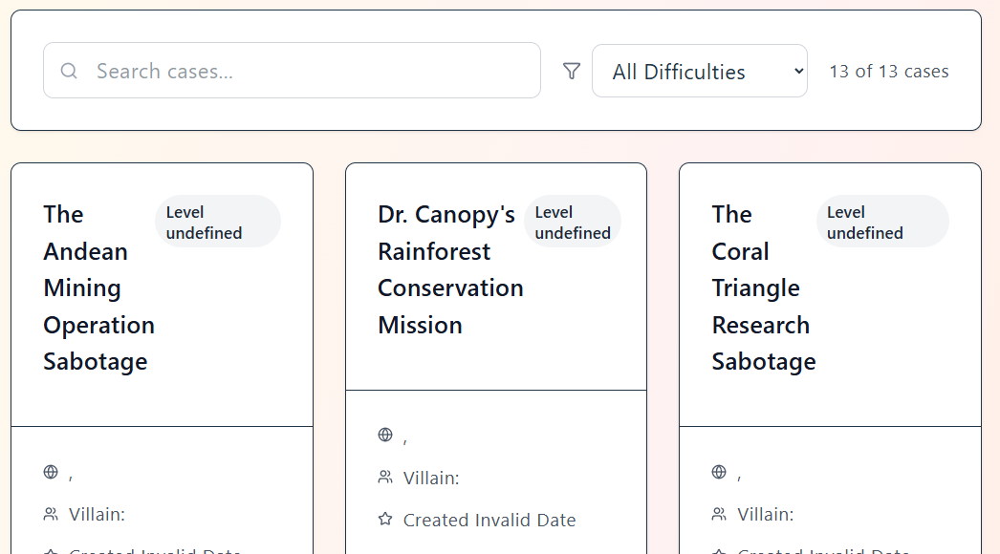

# Professor Tectonic: Jin Wei Ming

# VILLAIN CONTENT TEMPLATE

## Character Profile
- **Codename**: Professor Tectonic
- **Full Name**: Jin Wei Ming
- **Specialty**: Seismology & Geological Survey Engineering
- **Region**: East Asian Tectonic Systems (Ring of Fire, mountain ranges, river systems)
- **Cultural Background**: Professional excellence in geological engineering and earthquake preparedness science
- **Respect Note**: Focuses on professional expertise and geography.
- **Difficulty**: 4

## Educational Framework
- **Learning Objectives**: [Specific geography concepts taught]
- **Geographic Skills**: [Map reading, spatial reasoning, etc.]
- **Cultural Learning**: [Respectful cultural appreciation]
- **Cross-curricular**: [STEM, Social Studies, Language Arts connections]

## Professional Background
- **Academic Credentials**: [University, degrees, research focus]
- **Career Specialty**: [Specific area of expertise]
- **Research Interests**: [Current projects, publications]
- **Professional Motivation**: [Why they became a criminal - academic obsession, not cultural]
- **Signature Methods**: [Tools and techniques related to their field]

## Game Content

### Round 1: Geographic Foundation (Physical Geography)
**Clue Theme**: Physical features, climate, terrain, natural systems
- **Clue 1**: [Geological/topographical evidence]
- **Clue 2**: [Climate and weather patterns]
- **Clue 3**: [Natural resources or ecosystems]
- **Clue 4**: [Physical landmarks or formations]

### Round 2: Cultural Context (Human Geography)
**Clue Theme**: Demographics, languages, urban patterns, cultural practices
- **Clue 1**: [Language or communication patterns]
- **Clue 2**: [Population and settlement patterns]
- **Clue 3**: [Cultural traditions (respectfully presented)]
- **Clue 4**: [Educational or academic institutions]

### Round 3: Economic & Political Systems
**Clue Theme**: Government, trade, resources, international relations
- **Clue 1**: [Economic systems and trade]
- **Clue 2**: [Political structure or governance]
- **Clue 3**: [International connections]
- **Clue 4**: [Modern development and infrastructure]

### Round 4: Specific Features & Landmarks
**Clue Theme**: Unique identifiers, specific locations, distinctive characteristics
- **Clue 1**: [Famous landmark or monument]
- **Clue 2**: [Unique geographic feature]
- **Clue 3**: [Distinctive architecture or urban planning]
- **Clue 4**: [Specific location or "smoking gun" clue]

## Visual Specification
**Image Prompt**: "Vintage cartoon style: [professional role] in [work environment], wearing [modern professional attire], holding [scientific/research equipment], [appropriate geographic setting], warm muted palette with [specific colors], bold clean ink outlines, educational tone, dignified portrayal."

## Cultural Sensitivity Checklist
- [ ] Character defined by professional expertise, not ethnicity
- [ ] No cultural stereotypes, props, or caricatures
- [ ] Respectful representation of cultural context
- [ ] Professional attire appropriate to field work
- [ ] Focus on academic/scientific contributions
- [ ] Avoids harmful generalizations or outdated terms
- [ ] Educational value prioritized over entertainment stereotypes

## Implementation Data
- **Educational Tags**: [Geography standards alignment]
- **Clue Templates**: [Structured for database import]
- **Difficulty Justification**: [Why this difficulty level]
- **Assessment Opportunities**: [What teachers can evaluate]