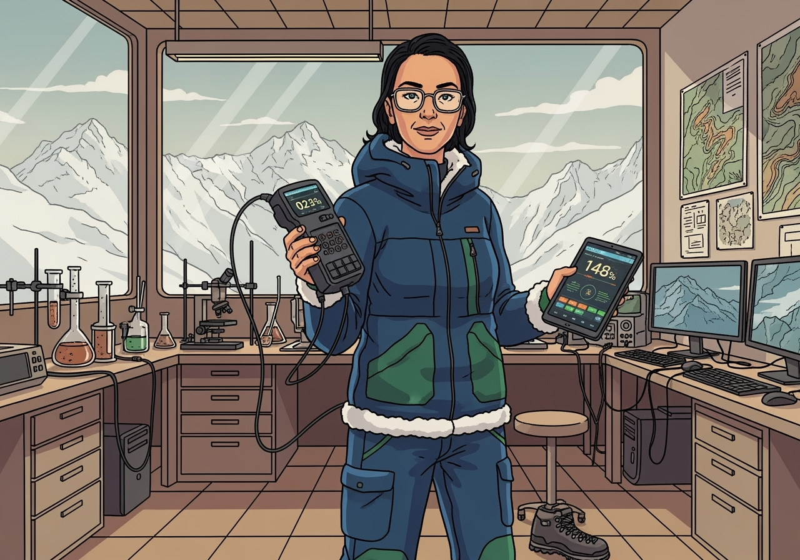

# Image Manifest — Dr. Meridian (Elena Fossat)

Folder: `content/villains/images/01-dr-meridian-elena-fossat`

Purpose: Inline‑view and document what’s visibly present in each image so we can align the character dossier precisely to the assets. Keep notes neutral and objective. Use the Alignment impact line to note any dossier or prompt adjustments.

Legend
- Scene type: lab, field, community, gallery, study, etc.
- Attire: jacket, boots, safety gear, etc. (professional; non‑stereotyped)
- Props/tools: instruments, maps, models, etc.
- Backdrop: mountains, lab bench, monitors, audience, etc.
- Tone/pose: calm, teaching, action, etc.
- Potential cultural flags: if any depictions need care (avoid stereotyping; keep dignified)
- Alignment impact: specific edits to dossier prompts/visual grounding

---

## generated-image-2025-09-25.png

Scene type: Alpine fieldwork on a high valley slope above a braided/curving river

Attire: Insulated field jacket (navy), green field pants with knee patches, hiking boots, glasses

Props/tools present: Portable field analyzer/datalogger with probe; multiple tripods with sensors; multirotor drone (grounded) for survey; calibration cylinder; coax/cables

Backdrop/setting elements: Steep glaciated valley walls; snow‑covered peaks; meandering river or proglacial stream below; alpine flowers in foreground

Tone/pose: Focused and precise; kneeling to calibrate or record a measurement; methodical

Potential cultural flags: Drone use — depict as research tool; avoid operational how‑to; respect protected‑area rules

Alignment impact: Emphasize field instrumentation, drone‑assisted surveys, and braided/proglacial river motifs in Visual Grounding; include “calibration on site” detail in prompts; tie to watershed/climate case seeds

---

## generated-image-2025-09-25 (1).png

.png)

Scene type: Mountain lab or analysis room

Attire: Insulated jacket with shearling trim; field pants; indoor boots off to the side

Props/tools present: Handheld instrument (0.23°C reading) tethered to probe; tablet with dashboard (148% metric); microscopes, glassware, computers/monitors showing terrain; wall maps (contours, relief)

Backdrop/setting elements: Large windows to snowy peaks; tiled floor; workbenches with lab equipment

Tone/pose: Demonstrative; presenting instruments to camera; confident and professional

Potential cultural flags: None apparent beyond general best practices (no sensitive datasets)

Alignment impact: Reinforce “lab analysis + field integration” motif; prompts can mention dashboards and cross‑checking lab/field measurements

---

## generated-image-2025-09-25 (2).png

.png)

Scene type: Alpine field monitoring site at a designated heritage location

Attire: Insulated hooded jacket (navy), gloves, green field pants, hiking boots, backpack; glasses

Props/tools present: Handheld datalogger with screen and antenna; tripods with weather/atmospheric sensors (anemometer, radiation shield); solar panel powering instruments; cabling

Backdrop/setting elements: Prominent pyramidal peak resembling the Matterhorn; snow‑covered slopes and ridges; wooden sign reading “UNESCO World Heritage Site” with snow cap

Tone/pose: Professional and observant; looking up while holding active instrument; calm, educational vibe

Potential cultural flags: UNESCO signage — ensure respectful use; avoid implying exclusive access; keep depiction as public educational context

Alignment impact: Add “World Heritage alpine monitoring” motif to Visual Grounding; include handheld datalogger and weather stations in tool list; prompt variant can mention “designated heritage site” without naming specific real‑world procedures; keep dignified portrayal of protected landscapes

---

## generated-image-2025-09-25 (3).png

.png)

Scene type: Classroom or community presentation with terrain/energy models

Attire: Field jacket with green accent panel, green pants, hiking boots; glasses

Props/tools present: 3D terrain model with river; wind‑farm and solar‑village dioramas; large wall maps; laptop; printed charts (bar/pie/time series)

Backdrop/setting elements: Picture windows to conifer forest and snowy alpine peaks; audience of students/community members

Tone/pose: Confident, approachable educator; explanatory stance

Potential cultural flags: Community setting — keep dignified and inclusive portrayal; avoid implying policy prescriptions beyond educational context

Alignment impact: Add “community presentation” motif; include models/dioramas in prompts; align case text to communicate trade‑offs (energy, land use) neutrally

---

## generated-image-2025-09-25 (4).png

.png)

Scene type: Village market consultation around a large topographic map

Attire: Field jacket and pants with backpack and hiking boots; hair tied back; glasses

Props/tools present: Oversized topo map on a wooden stand (contours, index, legend); cups/basket held by locals; winter market stalls

Backdrop/setting elements: Alpine village square with timber chalets, snow patches, conifer slopes, and distant peaks

Tone/pose: Warm, collaborative conversation; pointing/explaining features on the map to local residents

Potential cultural flags: Community portrayal—keep respectful and natural; avoid implying outsiders “telling locals” their terrain; frame as two‑way knowledge sharing

Alignment impact: Add “market‑square map consult” motif; prompts can mention collaborative mapping and local knowledge; use this scene for clue releases that rely on contour literacy and wayfinding landmarks
